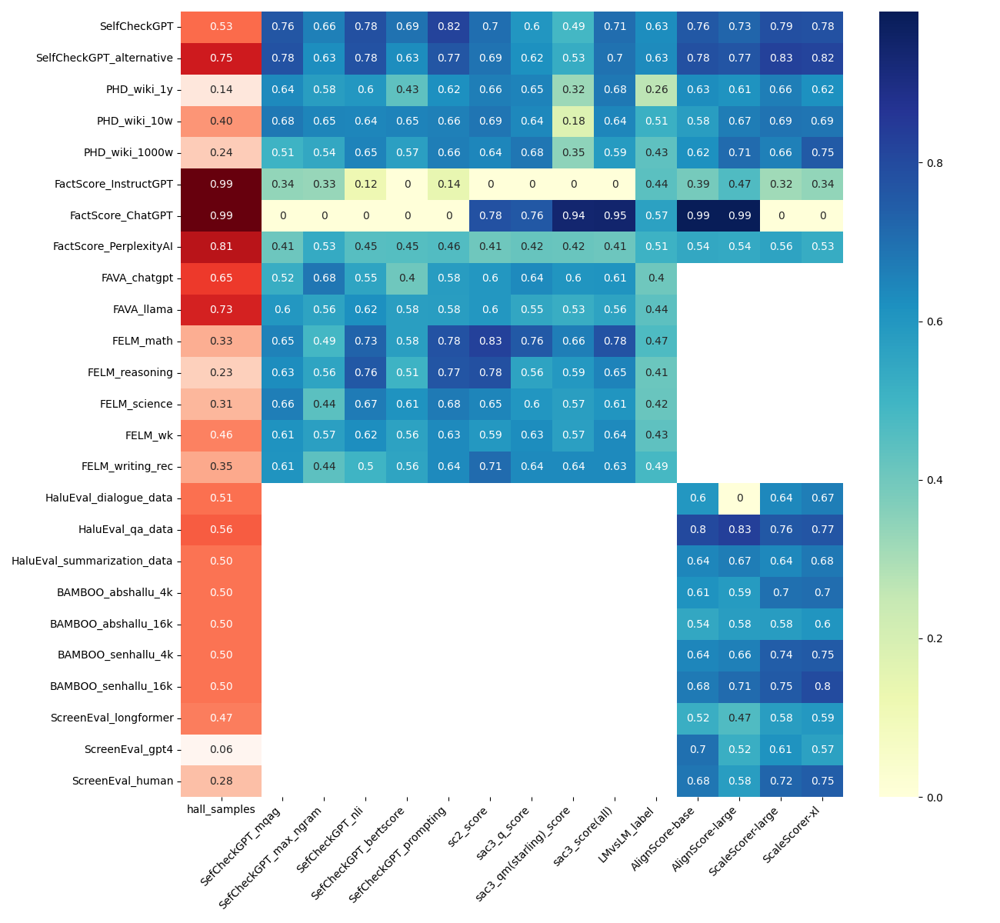

## 1. Intro

This repository contains the code and methodology used to conduct a feasibility study on benchmarking hallucination detection methods in modern Natural Language Processing (NLP). Identifying hallucinations produced by Large Language Models is extremely important, but a consistent framework or standard benchmark for comparing detection methods has been lacking.

The study explores the possibility of creating such a framework and investigates the challenges involved by running experiments using **8 distinct benchmarks and 5 detection methods** . Our findings revealed that benchmarking hallucination detection methods is highly intricate due to significant variability in both the benchmarks themselves and the methods employed.

## 2. Benchmarks Used

The study utilized eight benchmarks, categorized by downstream task, focusing on their format, annotation granularity, and label distribution. The overall objective was to address the challenge presented by the significant variability across these benchmarks.

| Benchmark Name | Category | Short Description | Key Paper / Source |
| :--- | :--- | :--- | :--- |
| **SelfCheckGPT-Wikibio** | General-Knowledge Text Generation | Focused on biographies generated from Wiki-Bio data. Manual annotation at the sentence level (Major/Minor Inaccurate, Accurate). | Manakul et al., 2023 [1] |
| **PHD** | General-Knowledge Text Generation | Utilizes Wikipedia entities across three categories (Low, Medium, High knowledge deficiencies). Manual annotation conducted at the passage level. | S. Yang et al., 2023 [2] |
| **FactScore** | General-Knowledge Text Generation | Generates biographies of Wiki-Bio entities using InstructGPT, ChatGPT, and PerplexityAI. Annotation occurs at a high granularity—the atomic claim level. | Min et al., 2023 [3] |
| **BAMBOO** | Summarization | Evaluates hallucination detection in summaries of scientific papers, using synthetically generated hallucinations (SenHallu and AbsHallu datasets). | Dong et al., 2023 [4] |
| **ScreenEval** | Summarization | Composed of TV scripts and summaries generated by humans, Longformer, and GPT-4. Human annotations indicate factual inconsistencies at the sentence level. | Lattimer et al., 2023 [5] |
| **HaluEval** | Summarization & QA | A multi-task benchmark including summarization, QA, and dialogue tasks, featuring a mix of synthetically generated and manually annotated data (General QA). | J. Li et al., 2023 [6] |
| **FELM** | Question-Answering (QA) | Provides a broad range of topics (e.g., World Knowledge, Math, Reasoning) and various factuality errors. Manual annotations conducted at the segment (sentence) level. | S. Chen et al., 2023 [7] |
| **FAVA** | Question-Answering (QA) | Recent QA benchmark using responses generated by ChatGPT and Llama2-Chat 70B, based on three query sources (Open Assistant, instruction-following, synthetic). Annotation is at the token level. | Mishra et al., 2024 [8] |

## 3. Systems (Hallucination Detection Methods)

Five hallucination detection methods were implemented and applied across the deployed benchmarks.

| System Name | Type | Short Description | Key Paper / Source |
| :--- | :--- | :--- | :--- |
| **SelfCheckGPT** | Reference-Free, Sampling/Consistency | Leverages the LLM's own ability by sampling multiple responses to measure consistency using different scores (e.g., BERTScore, NLI, Prompt). Lower scores indicate lower probability of hallucination. | Manakul et al., 2023 [1] |
| **SAC3** | Reference-Free, Sampling/Consistency | Extends consistency checking by including Question-level Cross-checking (semantically equivalent perturbed queries) and Model-level Cross-check (using an additional verifier LM, such as Starling-7B in the experiments). | J. Zhang et al., 2023 [9] |
| **LMvsLM** | Reference-Free, Prompting-Based | Uses an EXAMINER LLM to cross-examine claims from an EXAMINEE LLM through a multi-turn interaction to reveal inconsistencies. | Cohen et al., 2023 [10] |
| **AlignScore** | NLI-Based | A non-prompting, reference-dependent algorithm that calculates information alignment at the sentence-against-text-chunks level [28, 38, 40]. **Requires a reference text**. | Zha et al., 2023 [11] |
| **SCALE** | NLI-Based | An NLI-inspired, reference-dependent approach that decomposes the source document into larger chunks to aggregate entailment probabilities [28, 41, 42]. Known for its efficiency. **Requires a reference text** . | Lattimer et al., 2023 [6] |

## 4. Results

The experiments demonstrated that standardizing benchmarks and creating a common evaluation framework is complex.

### Results Visualization


*   **Benchmarking Difficulty:** Benchmarking proved highly intricate due to the large variability in benchmark properties, such as data format, annotation granularity, and the percentage of hallucinated passages.
*   **Replicability:** Most methods were replicated to an acceptably close degree compared to their reported results in original papers, though exact replication is not expected when utilizing LLMs.
*   **Threshold Generalization:** Setting a single, universal threshold to distinguish between factual and hallucinated content proved **impossible for most methods** across different benchmarks .
*   **Notable Generalization:** The **SAC3-QM(Starling)-all** method was observed to be an exception, showing the potential to generalize a single threshold effectively within datasets belonging to the same downstream task category (like QA tasks).
*   **Performance Extremes:** Nearly all evaluated methods achieved their **best performance on the SelfCheckGPT dataset** and their **worst performance on the FactScore PerplexityAI dataset** .
*   **Overall Performance:** The **LMvsLM approach was the overall worst-performing approach** across the tested methods, suggesting that purely prompt-based approaches without sampling or other supporting algorithms may be less effective.

### Visualization of the results in terms of G-Mean. The ratio of hallucinated samples is displayed in the first column.



### References

[1] *Manakul, P., Liusie, A., & Gales, M. (2023). SelfCheckGPT: Zero-resource black-box hallucination detection for generative large language models. Proceedings of the 2023 Conference on Empirical Methods in Natural Language Processing, 9004–9017. https://doi.org/10.18653/v1/2023.emnlp-main.557*

[2] *Yang, S., Sun, R., & Wan, X. (2023, December). A new benchmark and reverse validation method for passage-level hallucination detection. In H. Bouamor, J. Pino, & K. Bali (Eds.), Findings of the association for computational linguistics: Emnlp 2023 (pp. 3898–3908). Association for Computational Linguistics. https://doi.org/10.18653/v1/2023.findings-emnlp.256*

[3] *Min, S., Krishna, K., Lyu, X., Lewis, M., Yih, W.-t., Koh, P., Iyyer, M., Zettlemoyer, L., & Hajishirzi, H. (2023, December). FActScore: Fine-grained atomic evaluation of factual precision in long form text generation. In H. Bouamor, J. Pino, & K. Bali (Eds.), Proceedings of the 2023 conference on empirical methods in natural language processing*

[4] *Dong, Z., Tang, T., Li, J., Zhao, W. X., & Wen, J.-R. (2023). Bamboo: A comprehensive benchmark for evaluating long text modeling capacities of large language models. arXiv preprint arXiv:2309.13345*

[5] *Lattimer, B. M., Chen, P., Zhang, X., & Yang, Y. (2023). Fast and accurate factual inconsistency detection over long documents.*

[6] *Li, J., Cheng, X., Zhao, X., Nie, J.-Y., & Wen, J.-R. (2023, December). HaluEval: A large-scale hallucination evaluation benchmark for large language models. In H. Bouamor, J. Pino, & K. Bali (Eds.), Proceedings of the 2023 conference on empirical methods in natural language processing (pp. 6449–6464). Association for Computational Linguistics. https://doi.org/10.18653/v1/2023.emnlp-main.397*

[7] *Chen, S., Zhao, Y., Zhang, J., Chern, I.-C., Gao, S., Liu, P., & He, J. (2023). Felm: Benchmarking factuality evaluation of large language models. Thirty-seventh Conference on Neural Information Processing Systems Datasets and Benchmarks Track. http://arxiv.org/abs/2310.00741*

[8] *Mishra, A., Asai, A., Balachandran, V., Wang, Y., Neubig, G., Tsvetkov, Y., & Hajishirzi, H. (2024). Fine-grained hallucinations detections. arXiv preprint. https://arxiv.org/abs/2401.06855*

[9] *Zhang, J., Li, Z., Das, K., Malin, B., & Kumar, S. (2023, December). SAC3: Reliable hallucination detection in black-box language models via semantic-aware cross-check consistency. In H. Bouamor, J. Pino, & K. Bali (Eds.), Findings of the association for computational linguistics: Emnlp 2023 (pp. 15445–15458). Association for Computational Linguistics. https://doi.org/10.18653/v1/2023.findings-emnlp.1032*

[10] *Cohen, R., Hamri, M., Geva, M., & Globerson, A. (2023, December). LM vs LM: Detecting factual errors via cross examination. In H. Bouamor, J. Pino, & K. Bali (Eds.), Proceedings of the 2023 conference on empirical methods in natural language processing (pp. 12621–12640). Association for Computational Linguistics. https://doi.org/10.18653/v1/2023.emnlp-main.778*

[11] *Zha, Y., Yang, Y., Li, R., & Hu, Z. (2023, July). AlignScore: Evaluating factual consistency with a unified alignment function. In A. Rogers, J. Boyd-Graber, & N. Okazaki (Eds.), Proceedings of the 61st annual meeting of the association for computational linguistics (volume 1: Long papers) (pp. 11328–11348). Association for Computational Linguistics. https://doi.org/10.18653/v1/2023.acl-long.634*

## 5. Project Structure and Code Documentation

### 5.1 Project Overview

This repository implements a comprehensive benchmarking framework for hallucination detection methods. The project is organized into several key components:

- **Data Loading & Processing**: Scripts to load and standardize 8 different benchmarks
- **Method Implementations**: 5 different hallucination detection methods
- **Evaluation Pipeline**: Comprehensive evaluation and analysis tools
- **Visualization**: Tools for generating plots and visualizations

### 5.2 Directory Structure

```
benchmarking_hallucinations_detection/
├── data/                          # Benchmark datasets
│   ├── BAMBOO/                    # BAMBOO benchmark data
│   ├── HaluEval/                  # HaluEval benchmark data
│   ├── FactScore/                 # FactScore benchmark data
│   └── ...                        # Other benchmark datasets
├── methods/                       # Hallucination detection method implementations
│   ├── AlignScore/               # AlignScore method
│   ├── LMvsLM/                   # LMvsLM method
│   ├── sac3/                     # SAC3 method
│   └── selfcheckgpt/             # SelfCheckGPT method
├── outputs/                       # Generated results and visualizations
├── main.py                       # Main data loading script
├── methods_implementations.py    # Method implementation classes
├── read_load_data.py             # Data loading utilities
├── data_stats.py                 # Dataset statistics generation
├── aggregate_results.py          # Results aggregation and analysis
├── analyse_binary.py            # Binary classification analysis
├── graphs_generation.py          # Visualization generation
├── config.json                   # Configuration file
└── requirements.txt              # Python dependencies
```

### 5.3 Core Scripts Documentation

#### 5.3.1 Data Loading and Processing

**`main.py`** - Main data loading script
- **Purpose**: Loads and processes all benchmark datasets
- **Usage**: `python main.py`
- **Functionality**: 
  - Loads 8 different benchmarks (SelfCheckGPT, PHD, HaluEval, BAMBOO, FELM, FactScore, ExpertQA, FAVA)
  - Standardizes data format across different benchmarks
  - Handles different annotation granularities and label formats

**`read_load_data.py`** - Data loading utilities
- **Purpose**: Contains classes for loading and preprocessing each benchmark
- **Key Classes**:
  - `SelfCheckGPTData`: Loads SelfCheckGPT benchmark
  - `HaluEvalData`: Loads HaluEval benchmark with multiple task types
  - `PHDData`: Loads PHD benchmark with Wikipedia article retrieval
  - `FactScoreData`: Loads FactScore benchmark with atomic fact annotations
  - And more for each benchmark...

#### 5.3.2 Method Implementations

**`methods_implementations.py`** - Core method implementations
- **Purpose**: Implements all 5 hallucination detection methods
- **Key Classes**:
  - `SelfCheckGPT`: Implements SelfCheckGPT with multiple scoring methods (MQAG, BERTScore, N-gram, NLI, Prompting)
  - `LMvsLM`: Implements LM vs LM cross-examination method
  - `SAC3`: Implements SAC3 consistency checking method
  - `AlignScorer`: Implements AlignScore method (requires reference text)
  - `ScaleScorer`: Implements SCALE method (requires reference text)

#### 5.3.3 Analysis and Evaluation

**`data_stats.py`** - Dataset statistics
- **Purpose**: Generates comprehensive statistics for all datasets
- **Usage**: `python data_stats.py`
- **Output**: `outputs/data_stats.jsonl` with dataset size, hallucination ratio, average lengths

**`aggregate_results.py`** - Results aggregation
- **Purpose**: Aggregates results from all methods and benchmarks
- **Usage**: `python aggregate_results.py`
- **Output**: `outputs/results_full.json` with comprehensive evaluation metrics

**`analyse_binary.py`** - Binary classification analysis
- **Purpose**: Performs detailed binary classification analysis
- **Functionality**:
  - Calculates optimal thresholds for each method
  - Computes accuracy, precision, recall, F1-score, geometric mean
  - Handles different label transformations for each benchmark

**`analyse_binary_per_task.py`** - Task-specific analysis
- **Purpose**: Analyzes performance grouped by task type (QA, Summarization, etc.)
- **Usage**: `python analyse_binary_per_task.py`

#### 5.3.4 Data Processing Utilities

**`join_sac3_responses.py`** - SAC3 response joining
- **Purpose**: Combines SAC3 responses from different processing stages
- **Usage**: `python join_sac3_responses.py`

**`join_align_scale_responses.py`** - AlignScore/SCALE response joining
- **Purpose**: Combines AlignScore and SCALE responses for HaluEval datasets
- **Usage**: `python join_align_scale_responses.py`

#### 5.3.5 Visualization

**`graphs_generation.py`** - Benchmark landscape visualization
- **Purpose**: Creates scatter plots showing benchmark characteristics
- **Usage**: `python graphs_generation.py`
- **Output**: `outputs/scatter_plot_benchmarks.png`

**`visualize_results.py`** - Results visualization
- **Purpose**: Creates heatmaps and visualizations of results
- **Usage**: `python visualize_results.py`

**`visualize_results_per_task.py`** - Task-specific visualizations
- **Purpose**: Creates visualizations grouped by task type
- **Usage**: `python visualize_results_per_task.py`

### 5.4 Workflow and Usage

#### 5.4.1 Setup Instructions

1. **Install Dependencies**:
   ```bash
   pip install -r requirements.txt
   ```

2. **Download SpaCy Models**:
   ```bash
   python -m spacy download en_core_web_sm
   python -m spacy download en_core_web_md
   ```

3. **Set up API Keys** (create `.env` file):
   ```
   OPENAI_API_KEY=your_openai_key
   TOGETHER_API_KEY=your_together_key
   PEPRLEXITY_API_KEY=your_perplexity_key
   ```

4. **Download Method Checkpoints**:
   - Download AlignScore checkpoints to `methods/AlignScore/`
   - Download SCALE model files

#### 5.4.2 Complete Workflow

**Step 1: Load and Process Data**
```bash
python main.py
```

**Step 2: Generate Dataset Statistics**
```bash
python data_stats.py
```

**Step 3: Run Hallucination Detection Methods**
```bash
# For each method, run on each dataset
python methods_implementations.py
```

**Step 4: Join Responses (if needed)**
```bash
python join_sac3_responses.py
python join_align_scale_responses.py
```

**Step 5: Analyze Results**
```bash
python aggregate_results.py
python analyse_binary.py
python analyse_binary_per_task.py
```

**Step 6: Generate Visualizations**
```bash
python graphs_generation.py
python visualize_results.py
python visualize_results_per_task.py
```

#### 5.4.3 Configuration

The `config.json` file contains:
- Model configurations for each benchmark
- Task types and prompts
- Method-specific parameters

#### 5.4.4 Output Structure

Results are saved in the `outputs/` directory:
- `outputs/data_stats.jsonl`: Dataset statistics
- `outputs/results_full.json`: Complete evaluation results
- `outputs/results_per_task.json`: Task-specific results
- `outputs/*/`: Individual method results for each dataset
- `outputs/*.png`: Generated visualizations

### 5.5 Key Features

- **Comprehensive Benchmarking**: 8 diverse benchmarks covering different tasks
- **Multiple Detection Methods**: 5 state-of-the-art hallucination detection methods
- **Standardized Evaluation**: Consistent evaluation framework across all methods
- **Flexible Configuration**: Easy to add new benchmarks or methods
- **Rich Visualizations**: Multiple visualization types for result analysis
- **Reproducible Results**: All parameters and configurations are saved

### 5.6 Troubleshooting

- **Memory Issues**: Some methods (especially SelfCheckGPT) require significant memory
- **API Limits**: Monitor API usage for OpenAI, Together, and Perplexity APIs
- **GPU Requirements**: AlignScore and SCALE methods require GPU for optimal performance
- **Data Format**: Ensure all benchmark data is in the correct format in the `data/` directory

